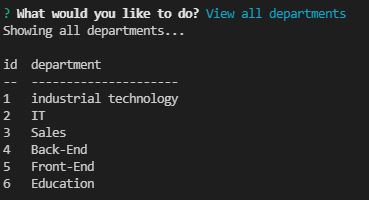
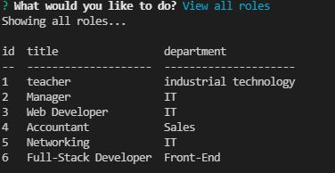
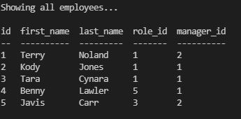
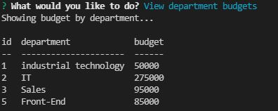

# Employee-Tracker

# Table of Contents

- [Description](#description)
- [Demo](#demo)
- [Screenshots](#screenshots)
- [Usage](#usage)

# Description

This application is a `content management systems` interface that allows users who are non-developers the ability to interact with information that is stored into database. Users will have the ability to store information such as departments, roles, employees and salary. This information is stored in many tables which are linked together to provide the information that coordinates with the selections made during the process of adding, updating and deleting information. Ideally, this database is a way to keep your business organized and make any necessary adjustments that may be needed along the way.

# Demo

[Play Demonstration](https://drive.google.com/file/d/1RqN_odogiXnJ7tq6vgZDXzOSw2jqQJeZ/view)

# Screenshots

#### Below are different views of tables that the user was able to select from the database.

`View of Departments`

`View of Roles`

`View of Employees`

`View of department budgets`

# Usage

_Given the user has installed the necessary packages, the user would enter `npm start` in the command line to prompt the application to begin_

# Author

## **_Javis Carr_**

### **Email:** Javis.Carr@gmail.com

### **LinkedIn:** [Click here](https://www.linkedin.com/in/javis-carr-8a584533/)
